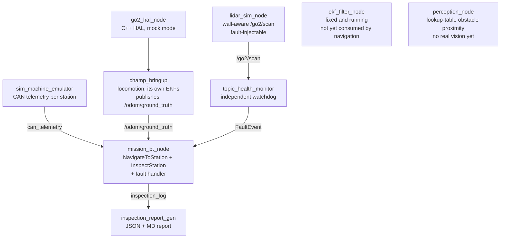

# go2-resilient-inspector
> A quadruped robot is deployed alone into an offshore facility no human can safely enter. It autonomously inspects machinery by reading live health telemetry against real thresholds. Partway through the mission its LiDAR fails. Instead of aborting, it detects the failure, degrades its navigation confidence and speed, and completes the mission anyway, then hands back a structured report that honestly flags which readings happened under reduced confidence.

**Platform:** Unitree Go2 (simulated) | **Stack:** ROS2 Humble + Gazebo Classic 11 + BehaviorTree.CPP v4 + champ quadruped framework

**Note on the robot model:** this project is simulated using the champ framework's `go1_config` (Unitree Go1) kinematics, since champ doesn't ship a Go2 model. "Go2 Resilient Inspector" names the mission scenario and the software system built around it, not a claim that the physical Go2 chassis is modeled in simulation.

---

## Demo

[](https://www.youtube.com/watch?v=m5qTH3oMhwk)

*Watch the lidar fault get injected at **1:39**, the fault detection and mode switch in the terminal, and the robot completing the remaining stations at reduced speed and confidence.*

---

## System Architecture



### Node summary
| Node | Language | Role |
|---|---|---|
| `go2_hal_node` | C++ | Hardware abstraction, mocks the real Go2 SDK's UDP interface |
| `champ_bringup` | (champ framework) | Quadruped locomotion/gait control; publishes `/odom/ground_truth` |
| `sim_machine_emulator` | Python | Publishes real per-station CAN telemetry (2 Hz), seeded anomalies at station_2 and station_4 |
| `lidar_sim_node` | Python | Ray-cast-aware `/go2/scan` at 10 Hz; supports fault injection via `/fault_inject/lidar` |
| `topic_health_monitor` | Python | Independent watchdog that detects topic silence and publishes `FaultEvent`. Runs as its own process so a planner crash can't disable it |
| `mission_bt_node` | C++ | BehaviorTree.CPP v4 patrol logic. Navigates using a proportional controller on `/odom/ground_truth`. On `FaultEvent`, caps speed (0.30 to 0.15 m/s) and drops confidence (0.95 to 0.60) for all subsequent readings |
| `inspection_report_gen` | Python | Aggregates results into JSON + Markdown reports |
| `ekf_filter_node` | C++ (robot_localization) | Fuses `/go2/odom` + `/go2/imu`. Runs correctly but isn't consumed by navigation yet, that's reserved for future Nav2 integration |
| `perception_node` | Python | Lookup-table-based obstacle proximity detection against a fixed set of known coordinates. A placeholder for real sensor-based perception, not actual image classification |
| `joy_teleop_node` | C++ | PS5 controller manual override, written but not yet wired into the launch file |

### Custom message types (`go2_interfaces`)
- `CanFrame.msg`: per-station CAN telemetry (temp, vibration, error code)
- `FaultEvent.msg`: fault detection notification (subsystem, type, recovery action)
- `InspectionResult.msg`: per-station inspection record with a confidence field

---

## The Fault Tolerance Mechanism

The differentiating feature of this system is what happens when the LiDAR is killed mid-mission.

1. `lidar_sim_node`'s `/go2/scan` goes silent (fault injected via `scripts/inject_fault.sh lidar`)
2. `topic_health_monitor` detects the silence within **2 seconds** and publishes a `FaultEvent` on `/mission/fault_event`
3. `mission_bt_node` receives the event and sets a global `degraded_mode = true` flag
4. Max velocity drops from 0.30 m/s to 0.15 m/s
5. All subsequent `InspectionResult` messages carry `confidence = 0.60` instead of `0.95`
6. The mission completes. It does not abort.

One thing worth being upfront about: navigation in this version reads `/odom/ground_truth` directly (Gazebo's simulated ground-truth position), not a sensor-fused estimate. The LiDAR fault degrades speed and confidence, but it doesn't currently force a switch between two different navigation algorithms, since ground-truth odometry is used in both modes. The `ekf_filter_node` (robot_localization) is implemented, fixed, and runs cleanly, but its fused output isn't wired into navigation yet. That's the next milestone, alongside Nav2 integration. The confidence drop still reflects real degraded sensor coverage and shows up honestly in the final report.

---

## Build & Run

### Prerequisites
```bash
# Ubuntu 22.04 + ROS2 Humble + Gazebo Classic 11
sudo apt install ros-humble-desktop ros-humble-robot-localization \
  ros-humble-behaviortree-cpp-v4 ros-humble-joy
```

### Build
```bash
cd Go2-Resilient-Inspector
source /opt/ros/humble/setup.bash
colcon build --symlink-install
source install/setup.bash
```
A handful of vendored third-party robot-config packages (other quadrupeds supported by the champ framework) are marked `COLCON_IGNORE` since they're ROS1/catkin and not needed here.

### Run: Happy path (no fault)
```bash
ros2 launch go2_bringup inspection.launch.py
```
Patrols all 5 stations at normal speed and confidence (0.95), generates a report at mission end.

### Run: With fault injection
In a second terminal, once the mission is underway:
```bash
./scripts/inject_fault.sh lidar
```
Watch the first terminal for the fault detection and mode switch. Restore with:
```bash
./scripts/restore_sensors.sh lidar
```

### Monitor live
```bash
ros2 topic echo /mission/fault_event
ros2 topic echo /mission/inspection_log
```

### View BT live in Groot2
```bash
ros2 launch go2_bringup inspection.launch.py enable_groot2:=true
```

### View generated report
```bash
cat /tmp/go2_inspection_reports/inspection_report_*.md
```

---

## Verification Checklist
Confirmed via live test runs:
- [x] Health monitor flags a killed topic within 2 seconds
- [x] BT switches to degraded mode within the same tick as receiving `FaultEvent`
- [x] Happy-path mission completes cleanly (5/5 stations, confidence 0.95, zero fault events)
- [x] Fault-injection mission completes cleanly (mid-mission NORMAL to DEGRADED transition, correct report)
- [x] Station_2 and station_4 correctly flagged as anomalous; stations 1, 3, 5 clean
- [x] Report Markdown and JSON generated correctly and are human-readable

Not yet verified:
- [ ] EKF localization accuracy against ground truth (EKF is fixed and running, but not yet consumed by navigation or benchmarked)
- [ ] Repeated fault-injection runs (only tested once per scenario so far, not a statistical sample)

---

## Code Reuse & Attribution
This project draws on patterns from prior work:

| Prior project | What was reused |
|---|---|
| `ROS2-system-inspector` | Heartbeat watchdog pattern in `topic_health_monitor` |
| `can-fault-monitor` | CAN message structure and fault taxonomy |
| `plc-kalman-ekf` | Structured telemetry pattern, EKF covariance tuning approach |

These are cited on purpose. This project is about integrating real systems well, not inventing new algorithms from scratch.

---

## Design Notes
- [HAL_DESIGN.md](HAL_DESIGN.md) covers where the mock hardware layer ends and real Go2 hardware would take over.

---

## What this project is NOT
- Not a real offshore deployment (see HAL_DESIGN.md for the mock boundary)
- Not a multi-robot system
- Not using Isaac Sim. Gazebo Classic 11 only, picked because it runs reliably on VirtualBox
- Not using real CAN/Modbus hardware (simulated topic publishing)
- Not using real computer vision. `perception_node` is a lookup-table placeholder for a future real perception integration
- Not using Nav2 yet. Navigation is a simple proportional controller on ground-truth odometry; Nav2 and EKF-fused localization are the next milestone

---

## Author
Asrith Pandreka: [asrithmoose148@gmail.com](mailto:asrithmoose148@gmail.com)
